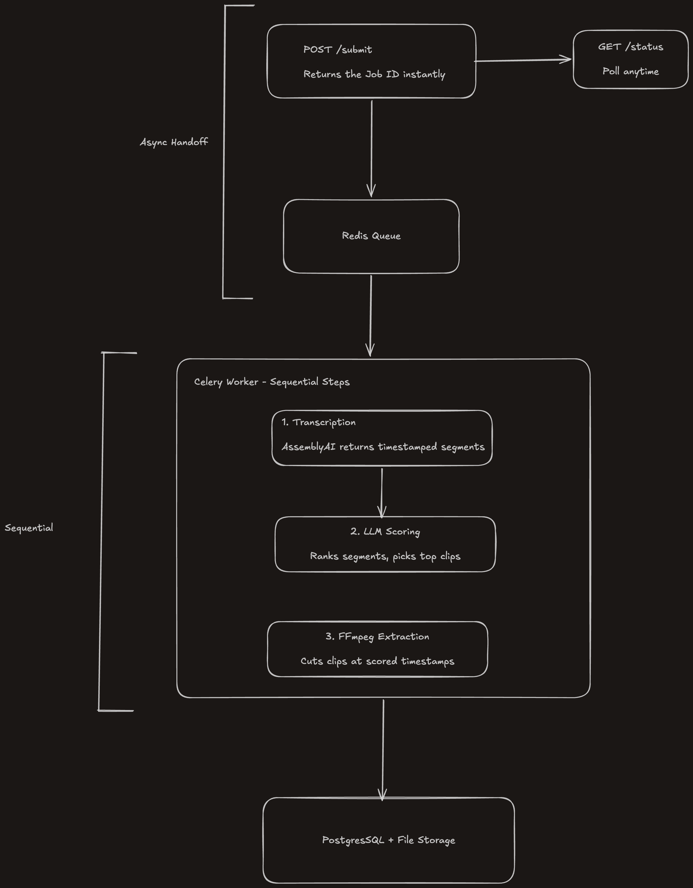

# AI-Editor-Pipeline
An async clip extraction pipeline that takes a YouTube URL, finds the most engaging moments, and returns short clips with metadata.
<<<<<<< HEAD

**Data Flow Diagram**

=======
>>>>>>> 1a7c2837cd017e5a0303f1eeb18234beb23ae952
